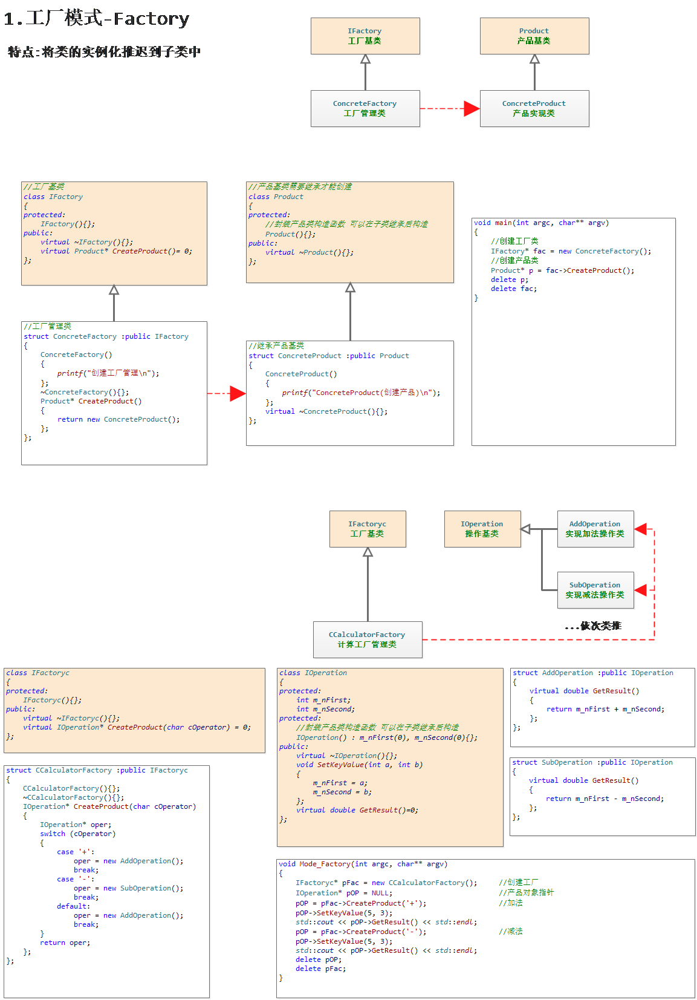
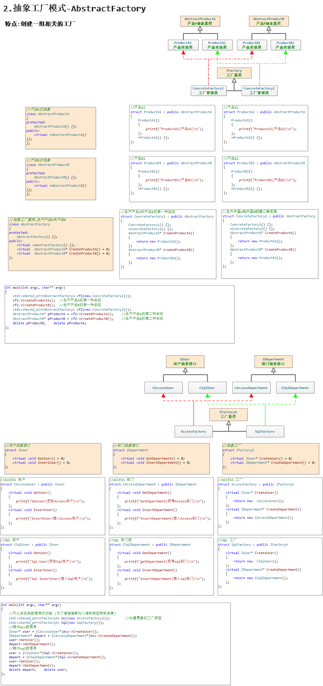
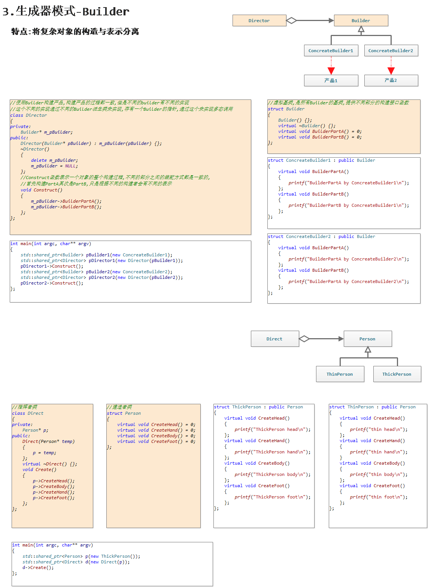
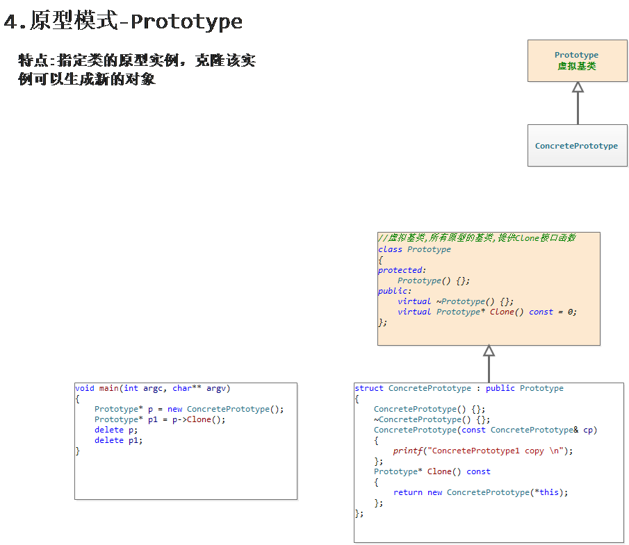
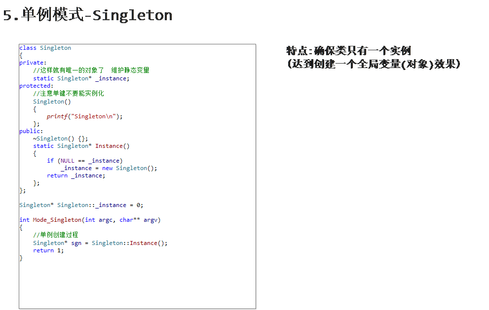
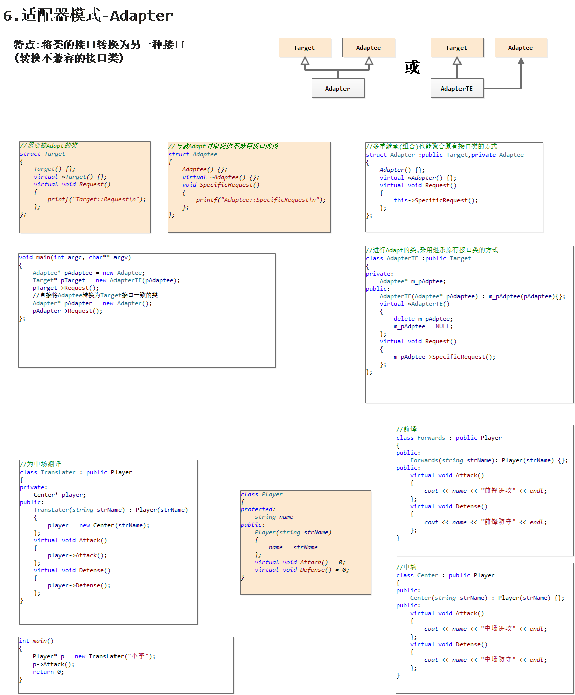
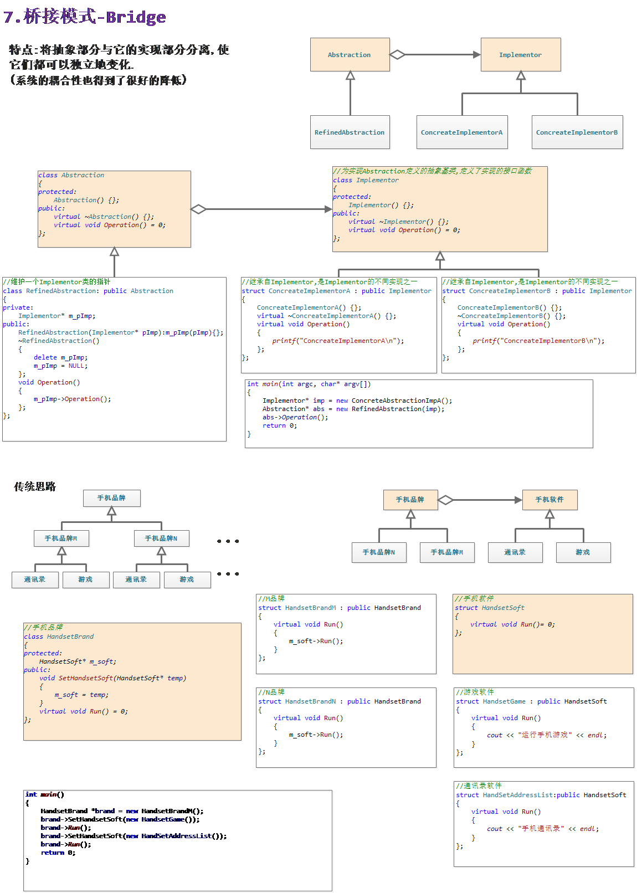
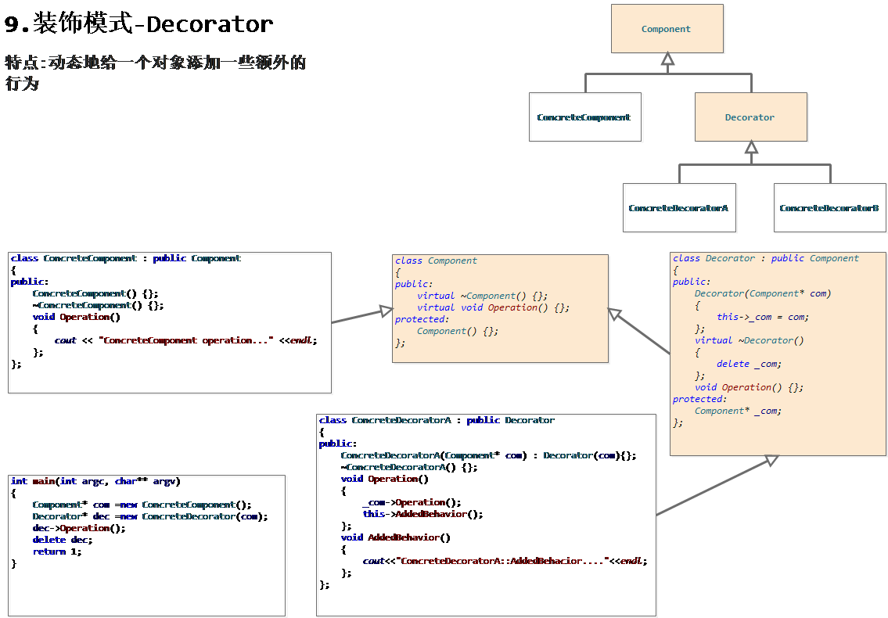
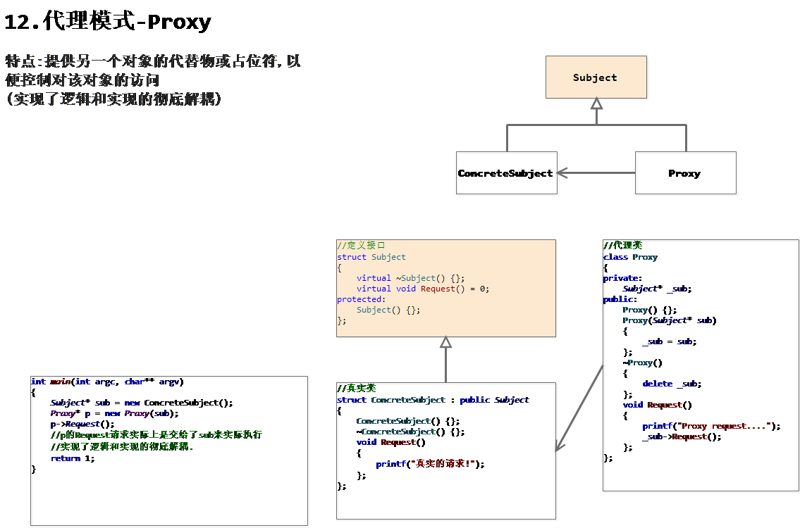
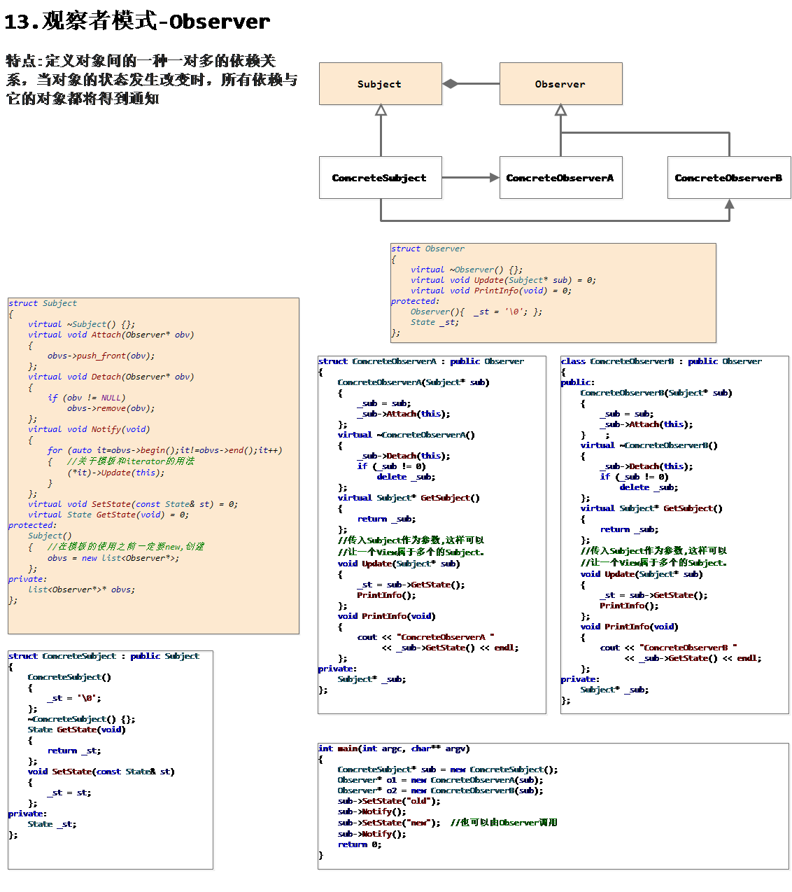

## 23种设计模式

### 工厂模式-Factory

### 抽象工厂模式-AbstractFactory

### 生成器模式-Builder

### 原型模式-Prototype

### 单例模式-Singleton

### 适配器模式-Adapter

### 桥接模式-Bridge

### 装饰模式-Decorator

### 代理模式-Proxy

### 观察者模式-Observer

